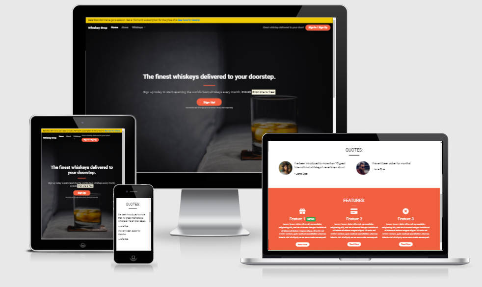

A live demo can be found [here](https://eva-kuk.github.io/whiskey-drop/)

### Overview
This project is a part of Code Institute FullStack Software Development Diploma course
which I have created during the tutorials made by at the Code Institute. 
This project was made to develop experience of learning Bootstrap as well as HTML and CSS. 
The aim was to create a "Whiskey Drop" site to the market for adults to deliver whiskey to your door.